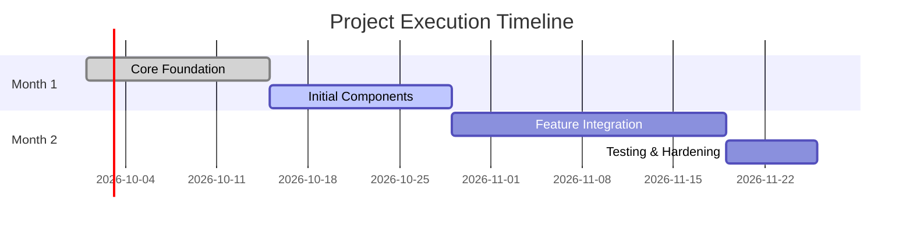

# Project Execution Plan & Monthly SWAG

Breaks down project requirements, design specifications, and technical estimates into a structured, achievable
month-by-month execution plan.

## Instructions

1. **Analyze Dependencies:** Identify the critical path. Determine prerequisite utilities, data models, or
   infrastructure before dependent features can start.
2. **Chunk by Value (Initiatives):** Group work into initiatives that deliver verifiable, testable milestones within
   ~4-week cycles.
3. **Validate Timing:** Use complexity analysis to ensure each month is achievable, with contingency for edge cases and
   testing.
4. **Structured Markdown Output:** Produce the plan adhering to the standard hierarchy below.

## Output Format

````markdown
# Project Execution Plan: [Project Name]

## 1. Executive Summary

| Month       | Initiative Theme | Primary Goal | Key Dependencies |
| :---------- | :--------------- | :----------- | :--------------- |
| **Month 1** | ...              | ...          | ...              |
| **Month 2** | ...              | ...          | ...              |

## 2. Visual Timeline



## 3. Detailed Monthly Breakdown

### Month 1: [Initiative Name]

**Focus:** One sentence summary of the core value delivered.

- **Key Deliverables:**
  - [ ] **[Component/Area]**: [Task Description] (Est: X Days)
  - [ ] **[Component/Area]**: [Task Description] (Est: Y Days)
- **Dependencies Resolved:** What blockers are cleared for subsequent months?
- **Risks & Unknowns:** Flag technical risks or integration questions.
- **Definition of Done:** Verifiable acceptance criteria for this month (tests passing, builds clean).

---

## 4. Parking Lot / Out of Scope

Items from the requirements that are deferred to later phases.
````
